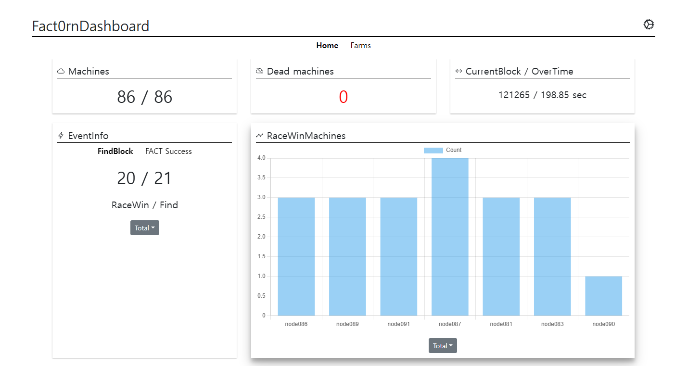
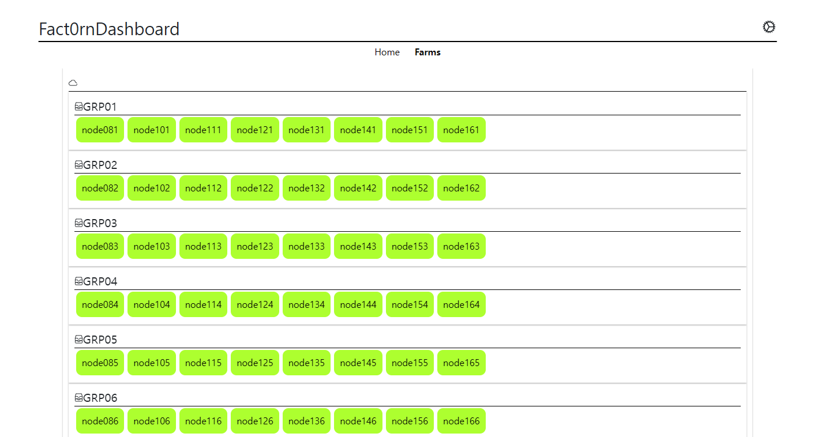
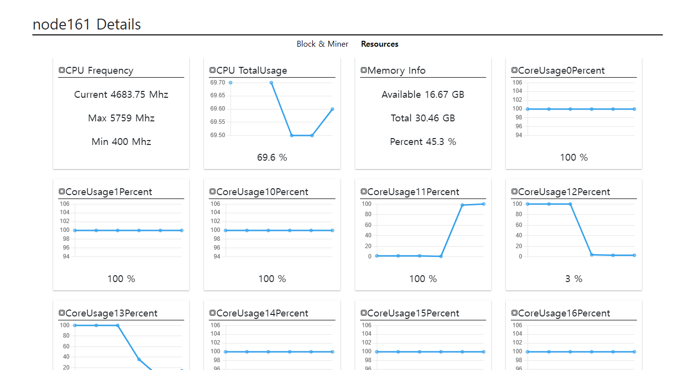

# Fact0rnDashboard 2.0







> Fact0rnDashboard server.

> Base: Ubuntu22.04

## ChangeLog

### 2.0

- We recreated the backend server.

   - Received data over UDP and changed the Python script from `threading` based to `async` based.
      - ※ We no longer retain data that arrives when the `DashBoardServer` is offline.
   
   - Unnecessary modules were removed, and short tasks were combined into a single task.

- It's better than the previous version, but it's also not perfect.

### 1.1

- Optimised backend failover times.

- You can add a `logs` tab to view the event logs of your nodes in real-time.

## MinerNode Setting

1. Connect the Fact0rnDashBoard server to the MinerNodes.

    ```shell
    cd $MINER_HOME/miners/fact_dist

    vi mine.sh
    ```

    > In mine.sh, make the following changes

    ```
    export MN_BROKER="fact0rn_net:9092"
    export FARM_GROUP="SAMPLE_FARM"
    export MINER_GROUP="SAMPLE_GROUP"
    ```
2. Change Domain setting
    ```shell
    sudo vi /etc/hosts
    ```
    > Append /etc/hosts
    ```
    SERVER_IP       fact0rn_net
    # example
    192.168.0.2        fact0rn_net
    ```

## Preparatory work.

> You should have the following tasks ready


1. A server PC that meets the recommended specifications.

    - RAM : 24 GB or more.
    - Storage : Minimum 200 GB, more is better.
    
    > Use the following applications..

        0. Docker , Docker-compose
        1. OpenSearch (High RAM, Disk usage.)
        2. PythonBackendServer

2. Your public IP for external access.
    > Set the external allowed access port to 2648. (You'll also need port 9092 as needed (if your server is in a different location to the MinerNode))


## Dashboard URL

> If installed correctly, you can access the URL below.

`http://{YOUR_IP_ADDR}:2648`

- In Local.

    `http://127.0.0.1:2648`

## ERROR: Cannot read properties of undefined (reading 'total')

> If you started the dashboard server a few minutes ago, you might not see EventInfo and RaceWinMachines because the backend server is still collecting information.

